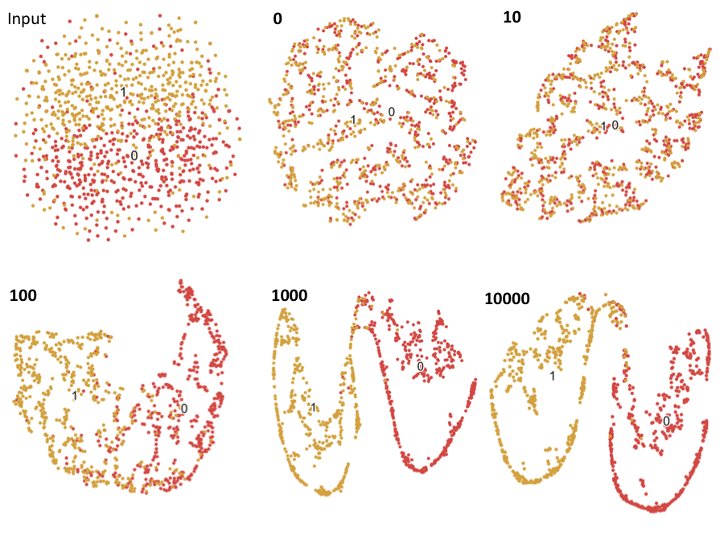

Denoising Autoencoders for Phenotype Stratification (DAPS)
===============
Denoising Autoencoder for Phenotype Stratification (DAPS) is a semi-supervised technique for exploring phenotypes in the Electronic Health Record (EHR).


Controls and 2 artificial subtypes of cases were simulated from 2 different models. The labels are the number of hidden nodes in the trained DAs. Principal component analysis and t-distributed stochastic neighbor embedding.


Citing DAPS
===========
Beaulieu-Jones, BK. and Greene, CS. "DAPS: Semi-Supervised Learning of the Electronic Health Record with Denoising Autoencoders for Phenotype Stratification.", *Under review*, 2016.

INSTALL
=======

DAPS relies on several rapidly updating software packages. As such we include package information below, but we also have a docker build available at: @TODO
 

Required
--------
* [Python] (https://www.python.org) (3.4).
* [Theano] (https://github.com/Theano/Theano) (0.70).
* [Seaborn] (http://stanford.edu/~mwaskom/software/seaborn/) & [MatPlotlib] (http://matplotlib.org/)
* [Scikit-Learn] (https://scikit-learn.org)


Optional
--------
* [iPython](http://ipython.org/) & [Jupyterhub] (https://github.com/jupyter/jupyterhub) - Required for visualization
* [CUDA] (https://developer.nvidia.com/cuda-toolkit-65) (7.5). This is listed as optional, but it's impractical to train more than 1000 samples without CUDA.


USAGE
=====


Running Simulations
--------
  
If changing the number of patients per simulation, it is important to also change the size of minibatches to keep the same ratio. I.e. For 100,000 patients you could do 1,000 patient mini-batches (for speed of training, if kept at 100 it will train but slower), if 1,000 you should do 10 (it will not effectively train with a mini-batch size of 100)

Below are a sampling of simulations run. Full parameter sweeps required > 72 hrs on an array of TitanX GPUs and it is recommended to choose an interesting subset.


**Simulation Model 1:**
 
```
python3 create_patients.py --run_name 1 --trials 10 --patient_count 10000 --num_effects 1 2 4 8 16 --observed_variables 100 200 400 --per_effect 10 --effect_mag 1 2 --sim_model 1 --systematic_bias 0.1 --input_variance 0.1 --missing_data 0
```

```
THEANO_FLAGS=mode=FAST_RUN,device=gpu0,floatX=float32,nvcc.fastmath=True python3 classify_patients.py --run_name 1 --patient_count 100 200 500 1000 2000 --da_patients 10000 --hidden_nodes 2 --missing_data 0
```

**Simulation Model 2:**

```
python3 create_patients.py --run_name 2 --trials 10 --patient_count 10000 --num_effects 1 2 4 8 --observed_variables 100 --per_effect 10 --effect_mag 2 5 --sim_model 2 --systematic_bias 0.1 --input_variance 0.1 --missing_data 0
```

```
THEANO_FLAGS=mode=FAST_RUN,device=gpu0,floatX=float32,nvcc.fastmath=True python3 classify_patients.py --run_name 2 --patient_count 50 100 200 500 1000 2000 --da_patients 10000 --hidden_nodes 2 4 8 --missing_data 0
```

**Simulation Model 3:**

```
python3 create_patients.py --run_name 3 --trials 10 --patient_count 10000 --num_effects 1 2 4 8 --observed_variables 100 --per_effect 10 --effect_mag 5 --sim_model 3 --systematic_bias 0.1 --input_variance 0.1 --missing_data 0
```

```
THEANO_FLAGS=mode=FAST_RUN,device=gpu1,floatX=float32,nvcc.fastmath=True python3 classify_patients.py --run_name 3 --patient_count 50 100 200 500 1000 2000 --da_patients 10000 --hidden_nodes 2 4 8 --missing_data 0
```


**Simulation Model 4:**

```
python3 create_patients.py --run_name 4 --trials 10 --patient_count 10000 --num_effects 2 4 8 --observed_variables 100 --per_effect 10 --effect_mag 10 --sim_model 4 --systematic_bias 0.1 --input_variance 0.1 --missing_data 0
```

```
THEANO_FLAGS=mode=FAST_RUN,device=gpu1,floatX=float32,nvcc.fastmath=True python3 classify_patients.py --run_name 4 --patient_count 50 100 200 500 1000 2000 10000 --da_patients 10000 --hidden_nodes 2 4 8 16 --missing_data 0
```


**Missing data:**
 
```
python3 create_patients.py --run_name md --trials 10 --patient_count 10000 --num_effects 2 4 8 16 --observed_variables 100 --per_effect 10 --effect_mag 2 --sim_model 1 --systematic_bias 0.1 --input_variance 0.1 --missing_data 0
```

```
THEANO_FLAGS=mode=FAST_RUN,device=gpu,floatX=float32,nvcc.fastmath=True python3 classify_patients.py --run_name md --patient_count 100 200 500 1000 --da_patients 10000 --hidden_nodes 2 --missing_data 0 0.1
```


Analyzing Results
--------

We've included 3 ipython notebook files to help analyze the results.

- Script used to generate the classification figures shown in the paper - Figures.ipynb
- Script used to generate the clustering images shown in the paper - Clustering.ipynb
- Examine a wide array of visualizations for a particular sweep - Visualize.ipynb
 

Selected Results
--------


Classification AUC in relation to the number of labeled patients under simulation model 1 (RF – Random Forest, NN – Nearest Neighbors, DA – 2-node DA + Random Forest, SVM – Support vector machine).


Case vs. Control clustering via principal components analysis and t-distributed stochastic neighbor embedding throughout the training of the DA (raw input to 10,000 training epochs) for simulation model 1.

Feedback
--------
Please feel free to email me - (brettbe) at med.upenn.edu with any feedback or raise a github issue with any comments or questions.


Acknowledgements
--------
This work is supported by the Commonwealth Universal Research Enhancement (CURE) Program gratn from the Pennsylvania Department of Health as well as the Gordon and Betty Moore Foundation's Data-Driven Discovery Initiative through Grant GBMF4552 to C.S.G.
 
We're grateful for the support of [Computational Genetics Laboratory](http://epistasis.org), the [Penn Institute of Biomedical Sciences](http://upibi.org/) and in particular Dr. Jason H. Moore for his support of this project.

We also wish to acknowledge the support of the NVIDIA Corporation with the donation of one of the TitanX GPUs used for this research.


